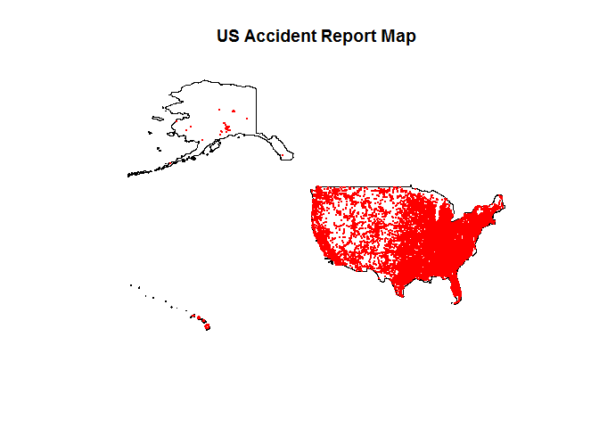
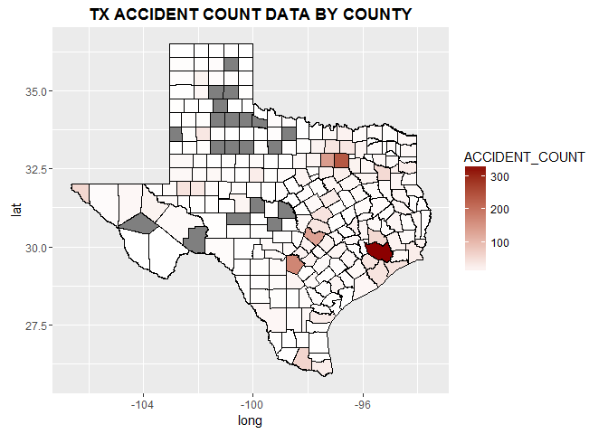

# HW#2 Traffic Accident Data Mapping
Blake C. Kronkosky, P.E.  
Saturday, September 19, 2016  

This is an R Markdown document GEOG 5330 HW #2. Data was obtained from GITHUB.
Provided below is the code to map accident data for the US.


```r
#libraries used-------
library(sp)
```

```
## Warning: package 'sp' was built under R version 3.1.3
```

```r
library(maptools)
```

```
## Warning: package 'maptools' was built under R version 3.1.3
```

```
## Checking rgeos availability: TRUE
```

```r
library(ggplot2)
```

```
## Warning: package 'ggplot2' was built under R version 3.1.3
```

```r
library(dplyr)
```

```
## Warning: package 'dplyr' was built under R version 3.1.3
```

```
## 
## Attaching package: 'dplyr'
```

```
## The following objects are masked from 'package:stats':
## 
##     filter, lag
```

```
## The following objects are masked from 'package:base':
## 
##     intersect, setdiff, setequal, union
```

```r
#--------------------
```


```r
dir<-"D:\\GEOG5330\\R\\week3-bckronkosky"
setwd(dir)

#===============================US overall plot===================
usshape   <-readShapeSpatial('US_Bndry_Jursidictional_TIGER.shp',
                             proj4string = CRS("+proj=longlat")
                            )

accidents               <- read.csv('accident.csv',stringsAsFactors=FALSE )
accidents               <- accidents[accidents$LONGITUD<0,]
coordinates(accidents)  <- ~LONGITUD+LATITUDE

plot(usshape, main="US Accident Report Map")
points(accidents,pch=16,cex=.05, col="red" )
```

<!-- -->

```r
#================================================================
```

This is a script that maps Texas County Accident Count Data.


```r
#======================Texas County count plot==================
txshape   <-readShapeSpatial('Tx_CntyBndry_Jurisdictional_STRATMAP.shp',
                             proj4string = CRS("+proj=longlat")
                            )
txshape                <- fortify(txshape,region='FIPS')
colnames(txshape)[6]   <- 'FIPS'
txshape$FIPS           <- as.integer(txshape$FIPS)

tx.accidents           <- read.csv('accident.csv',stringsAsFactors=FALSE )
tx.accidents           <- as.integer(tx.accidents[tx.accidents$STATE==48,10])
tx.accidents           <- data.frame(table(tx.accidents))
colnames(tx.accidents) <- c('FIPS','ACCIDENT_COUNT')
tx.accidents$FIPS      <-   as.integer(levels(tx.accidents[,1]))

txshape                <- left_join(x = txshape ,y = tx.accidents,by = 'FIPS')

ggplot() +
geom_polygon(data=txshape, 
               aes_string(x="long",y="lat", group="FIPS", fill= 'ACCIDENT_COUNT'),
               color="black",
               size=0.25
             ) + 
scale_fill_gradient(low = "white", high = "darkred") +
ggtitle('TX ACCIDENT COUNT DATA BY COUNTY')+
theme(plot.title = element_text(lineheight=1.5, face="bold"))  
```

<!-- -->

```r
#===============================================================
```

